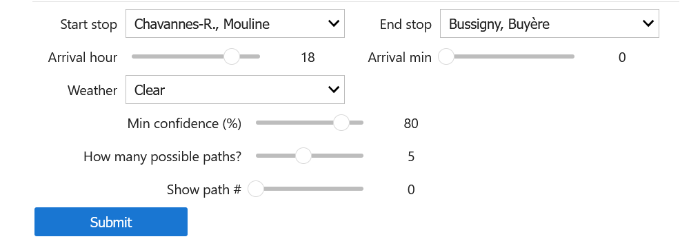
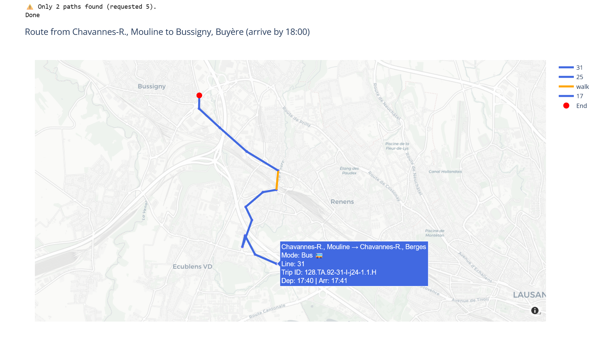

# Final Assignment: Robust Journey Planning
## Motivation and description of the project

Most journey planner applications for public transports focus only on giving the fastest route regardless of how reliable this route is. This leads to public transport users potentialy missing a connection and arriving late to their final destination.

With this project, we solved this issue by implementing a journey planner that provides the fastest routes given a confidence level set by the user. This project has been implemented for the swiss public transportation network.

More precisely, given a departure stop, an arrival stop, an arrival time, a number of alternative route k, and a confidence level, our journey planner returns k (or less route if no more route found) alternative routes that are the fastest given a certain probability of arriving on time.

Our planner takes into account historical delay data, weather data and time data to compute the probability of feasability of a route.

Currently, our planner works for the following regions:  Lausanne and Ouest lausannois. It works for the working hours (Monday-Friday, 6:00-20:00).

## Description of our method

### Transport Network model

The Network infrastructure is modeled as a directed graph with multiple edges between node pairs. The nodes represent stops. The edges represent connections between nodes, with their attributes.(departure & arrival times)

There are 3 types of edges based on the type of connection:

- Transit edges: represent public transport routes (e.g., train, bus, tram). 
  - Attributes: trip ID.

- Transfer edges: given in the SBB table, represents connections given in between different
transport modes (e.g., from a bus to a tram). 
  - Attributes: transfer type, minimum transfer time (required to switch between transport
modes).

- Walking edges: represent walking connections between nearby stops, (< 500 meters apart). We calculated this table ourselves. 
  - Attributes: duration (= time required to walk from one stop to another, based on the distance
and on a speed of 50m/min).

Both transfer and walking edges may seem redundant, but the algorithm will chose the shorter edge
if there are duplicates

### Delays model

We used a logistic regression to predict if a connection is delayed or not (binary classification). We used the following features for training : 
- Rain: Indicates whether it is currently raining
(binary: rain or no rain)

- Time-based: Day of the week, hour of day 

- Historical trends: Average delay by hour and station
(temporal & spatial patterns)

The confidence of a route confidence is computed as the product of delay probabilities for each route’s connections.

Class weights are used to handle class imbalance. Cross-validation & hyperparameter tuning are used to improve the model's performance.

### Route planning algorithm 

Backward Dijkstra's algorithm is used to find the k most optimal routes. We start from the destination and work backwards to the origin node, adding the best valid connection at each step. We return the K best routes, providing multiple alternatives. We sort the routes by latest departure, ensuring users leave as late as
possible while arriving on time.

Only routes with confidence ≥ desired threshold are selected. And routes are added only if they are not duplicates of an already‐stored route (same route, different trip ID).

The following optimizations have been used:

- Heap queue: Efficiently select the next best route

- Node visits: Each node is visited at most a given number of time, controlling runtime and avoiding
unnecessary iterations.

## Content of the repository

#### - `preprocessing.ipynb`

Prepares and writes out all region-specific SBB stop/stop\_time tables that downstream code relies on. It uses the following tables: `iceberg.sbb.stops` and `iceberg.sbb.stop_times`. This notebook contains the list of region names with which the planner will work (e.g. “Lausanne”, “Ouest lausannois”).

#### - `delay_model.py`

Trains a Spark-based logistic regression model to predict whether a train arrives ≥ 5 minutes late. It uses the istdaten table, weather data and regional station metadata.

#### - `main.ipynb`

Builds a multimodal transit graph for the considered regions, incorporating scheduled ride legs, official transfers, walking connections, and predicted delays. It uses the Parquet/Iceberg tables, the tables created by `preprocessing.ipynb` (`sbb_stops_region`, `sbb_stop_times_region`, etc.) and the saved delay prediction model and its aggregate CSVs (`avg_delay_by_hour.csv`, `avg_delay_by_bpuic.csv`).

 

---
## How to use the journey planner

To use the robust journey planner, you only need to run the entire `main.ipynb` notebook. This notebook takes 19min to run.

The current day is set in the following line: `arrival_time = datetime.datetime(2025, 5, 14, arrival_hour, arrival_minute)`in the last cell of `main.ipynb`.

The last cell of `main.ipynb` contains a user interface which allows to enter:

- the start stop
- the end stop
- the arrival time
- the weather conditions
- the confidence treshold for the paths the planner will provide
- the number of alternative paths the planner should provide
- the number of the path the user wants to see (among the different alternative paths)  

 
 

    
    <figcaption>The journey planner's settings</figcaption>

 
 

After clicking `submit`, the planner provides to the user an interactive map. On the interactive map the following information is displayed:
- the path from the start and end stop.
- the transport modes used to complete the journey
- the information on each segment of the journey

The user interface takes from 30s to 1min to produce an output.

If the number of found alternative paths is smaller than the number of requested paths a warning message appears indicating the number of actual paths found.

    
    <figcaption>The journey planner's output</figcaption>

## How to expand the geographical regions of the planner?
- The new region names need to be added to the list of regions at the beginning of both `preprocessing.ipynb` and `delay_model.py` notebooks ('names_list')
- It is needed to run entirely `preprocessing.ipynb` and `delay_model.py`

Then, it will be possible to use the planner with the same procedure as explained before: it is just needed to run the entire `main.ipynb` notebook and the planner can be used in the last cell of this notebook.

## Data Source

### Actual (IstDaten) data

Informations on this dataset can be found [here](https://opentransportdata.swiss/en/cookbook/actual-data/). 

`sbb_istdaten`:

- _operating_day_: day of operation when the journey took place. 		
- _trip_id_: correspond to the journey ID
- _operator_id_: operator code
- _operator_abrv_: operator short name
- _operator_name_: operator name
- _product_id_: mode of transport (bus, tram, ...)
- _line_id_: identify the line
- _line_text_: name of the line, e.g. 701
- _circuit_id_: schedule and route of a given vehicle
- _transport_: description of the type of transport
- _unplanned_: if true this is an additional (unplanned) journey
- _failed_: if true, the journey failed (didn't complete)
- _bpuic_: stop BPUIC
- _stop_name_: stop name (until mid 2021 you could also find the BPUIC there)
- _arr_time_: expected arrival time
- _arr_actual_: actual arrival time
- _arr_status_: method used to compute actual arrival time
- _dep_time_: expected departure time
- _dep_actual_: actual departure time
- _dep_status_: method used to compute actual departure time
- _transit_: if true, vehicle does not stop at the location

### Timetable data

Timetable data are available from opentransportdata.swiss's [timetable](https://opentransportdata.swiss/en/cookbook/gtfs/) data set.

The timetables are updated weekly (_pub_date_).

The full description of the GTFS format is available in the opentransportdata.swiss data [timetable cookbooks](https://opentransportdata.swiss/en/cookbook/gtfs/).

We provide a summary description of the data below:

`sbb_stops`: ([doc](https://opentransportdata.swiss/en/cookbook/gtfs/#stopstxt))

- _pub_date_: date of publication (weekly)
- _stop_id_: unique identifier (PK) of the stop, it is the BPUIC with platform information
- _stop_name_: long name of the stop
- _stop_lat_: stop latitude (WGS84)
- _stop_lon_: stop longitude
- _location_type_:
- _parent_station_: if the stop is one of many collocated at a same location, such as platforms at a train station

`sbb_stop_times`:

- _pub_date_: date of publication (weekly)
- _trip_id_: identifier (FK) of the trip, unique for the day - e.g. _1.TA.1-100-j19-1.1.H_
- _arrival_time_: scheduled (local) time of arrival at the stop (same as DEPARTURE_TIME if this is the start of the journey)
- _departure_time_: scheduled (local) time of departure at the stop 
- _stop_id_: stop (station) BPUIC identifier (FK), from stops.txt
- _stop_sequence_: sequence number of the stop on this trip id, starting at 1.
- _pickup_type_:
- _drop_off_type_:

`sbb_trips`: ([doc](https://opentransportdata.swiss/en/cookbook/gtfs/#tripstxt))

- _pub_date_: date of publication (weekly)
- _route_id_: identifier (FK) for the route. A route is a sequence of stops. It is time independent.
- _service_id_: identifier (FK) of a group of trips in the calendar, and for managing exceptions (e.g. holidays, etc).
- _trip_id_: is one instance (PK) of a vehicle journey on a given route - the same route can have many trips at regular intervals; a trip may skip some of the route stops.
- _trip_headsign_: displayed to passengers, most of the time this is the (short) name of the last stop.
- _trip_short_name_: internal identifier for the trip_headsign (note TRIP_HEADSIGN and TRIP_SHORT_NAME are only unique for an agency)
- _direction_id_: if the route is bidirectional, this field indicates the direction of the trip on the route.
    
`sbb_calendar`:

- _pub_date_: date of publication (weekly)
- _service_id_: identifier (PK) of a group of trips sharing a same calendar and calendar exception pattern.
- _monday_.._sunday_: FALSE (0) or TRUE (1) for each day of the week, indicating occurence of the service on that day.
- _start_date_: start date when weekly service id pattern is valid
- _end_date_: end date after which weekly service id pattern is no longer valid
    
`sbb_routes`: ([doc](https://opentransportdata.swiss/en/cookbook/gtfs/#routestxt))

- _route_id_: identifier for the route (PK)
- _agency_id_: identifier of the operator (FK)
- _route_short_name_: the short name of the route, usually a line number
- _route_long_name_: (empty)
- _route_desc_: _Bus_, _Zub_, _Tram_, etc.
- _route_type_:

**Note:** PK=Primary Key (unique), FK=Foreign Key (refers to a Primary Key in another table)

### Geo spatial data

We used the `geo` table.

`geo`:
* _uuid_: unique identifier of the shape (swiss topo)
* _name_: a human readable name of the shape
* _country_: country containing the shape, e.g. _CH_
* _region_: region or canton, e.g. _VD_
* _level_: shape class level, e.g. _city_, _canton_, ...
* _wkb_geometry_: binary (WKB) representation of the shape that can be used in Geospatial UDF functions.

### Weather data

We used the data from [wunderground](https://www.wunderground.com/history/daily/ch/r%C3%BCmlang/LSZH/date/2022-1-1). Location of used data: on HDFS under _/data/com-490/json/weather_history/_ and _/data/com-490/csv/weather_stations/_.
